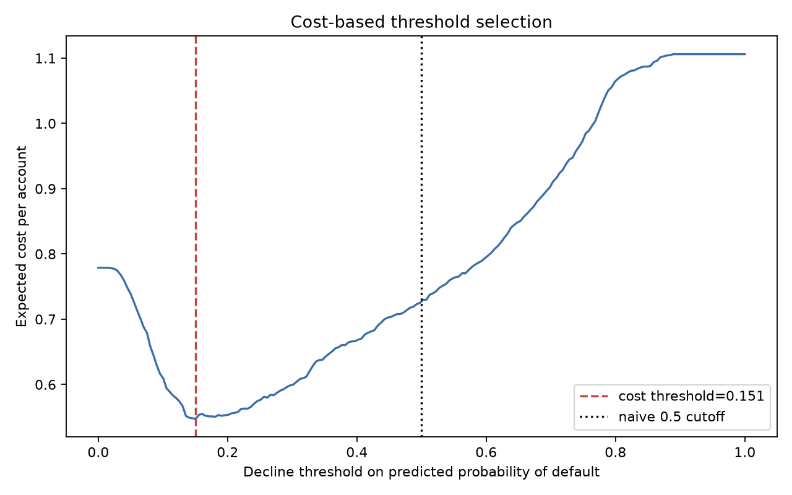
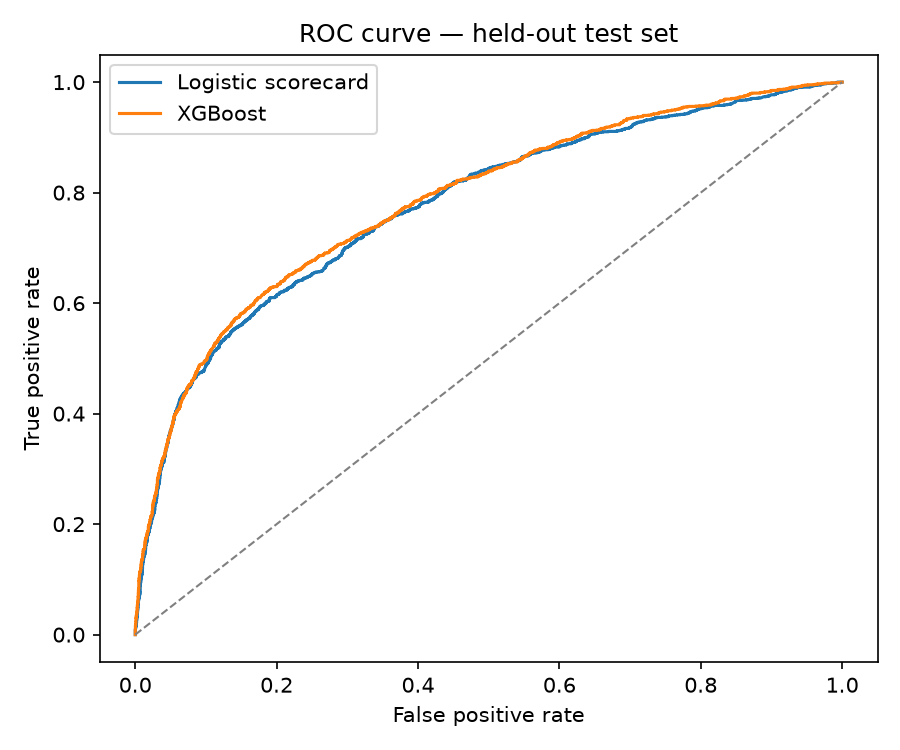
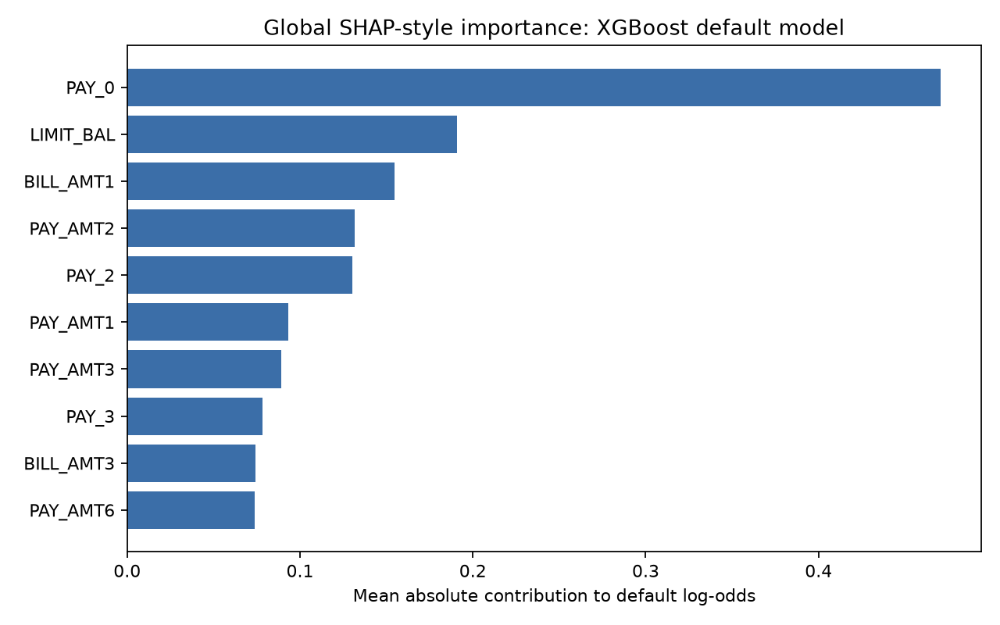
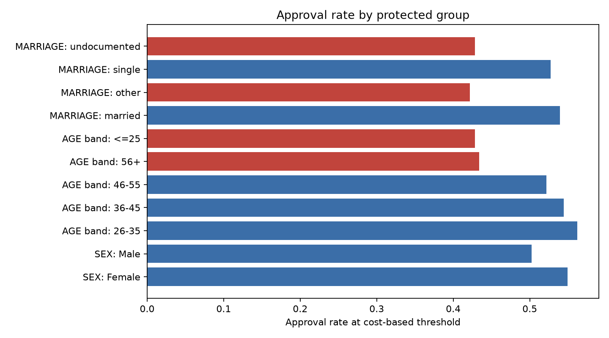

# Fair Explainable Credit Risk

**Credit default model built for model risk review.**
Compare the scorecard and challenger → explain decisions → audit fairness → choose the threshold by economics.


---

## The Headline

The best-performing model is XGBoost, but the business decision is not "use a 0.5 cutoff."

On the 7,500-account held-out set, XGBoost beats the WoE scorecard on ranking power (`AUC 0.7835`, `KS 0.4365`). A cost-based approval threshold of `0.151` cuts expected cost from `0.7263` to `0.5473` per account and raises expected profit from `0.0525` to `0.2315`, while reducing the approved-book default rate from `15.7%` to `9.4%`.

The tradeoff is real: approval rate falls from `87.5%` to `53.1%`, and the fairness audit flags AGE band and MARRIAGE approval-rate parity for monitoring.

| Policy | Threshold | Approval rate | Approved default rate | Expected cost | Expected profit |
|---|---:|---:|---:|---:|---:|
| Naive 0.5 cutoff | 0.5000 | 87.5% | 15.7% | 0.7263 | 0.0525 |
| Cost-based threshold | 0.1508 | 53.1% | 9.4% | 0.5473 | 0.2315 |



---

## Model Comparison

| Model | ROC-AUC | KS | Gini | Role |
|---|---:|---:|---:|---|
| Logistic scorecard (WoE + IV) | 0.7752 | 0.4191 | 0.5504 | transparent benchmark |
| XGBoost | 0.7835 | 0.4365 | 0.5670 | selected challenger |



The scorecard's top IV feature is `PAY_0` (`0.8628`). XGBoost's global SHAP-style contribution view agrees: `PAY_0` is the strongest driver (`0.4706` mean absolute contribution), followed by `LIMIT_BAL`, `BILL_AMT1`, and recent payment amounts.



---

## Reason Code Example

For declined applicant `ID 10745`, the model estimates `88.5%` probability of default. Top reason codes:

1. Most recent repayment status shows delinquency or delayed payment.
2. Prior-month repayment status shows delinquency or delayed payment.
3. Recent bill balance is high relative to the portfolio pattern.
4. Six-month repayment status shows delinquency or delayed payment.

These are generated from XGBoost contribution values in `notebooks/03_explainability.ipynb`, not hand-written after the fact.

---

## Fairness Audit

Protected attributes are excluded from model features and retained for audit. At the selected threshold:

| Attribute | Worst group by approval parity | Disparate impact ratio | TPR gap | Below 0.8? |
|---|---|---:|---:|---|
| SEX | Male | 0.914 | 0.002 | No |
| AGE band | <=25 | 0.762 | 0.131 | Yes |
| MARRIAGE | other | 0.782 | 0.308 | Yes |

The proxy test is honest: excluding protected attributes does **not** remove every disparity. The protected-excluded candidate still flags AGE band and MARRIAGE approval-rate gaps, which means repayment and balance variables carry correlated risk/proxy signal. A protected-included test model worsens several parity metrics, so exclusion helps but does not close the review.



---

## How It Works

```
src/credit_risk/data.py          loading, protected-attribute split, stratified train/test split
src/credit_risk/woe.py           WoE binning and information value for the scorecard
src/credit_risk/metrics.py       ROC-AUC, KS, Gini, calibration
src/credit_risk/reason_codes.py  scorecard and XGBoost contribution reason codes
src/credit_risk/fairness.py      approval parity, disparate impact, TPR gap, calibration
src/credit_risk/threshold.py     expected cost and expected profit threshold selection
```

Notebooks:

```
01_eda.ipynb             data quality and segment default rates
02_models.ipynb          scorecard vs. XGBoost and base artifacts
03_explainability.ipynb  global importance and local reason codes
04_fairness.ipynb        protected-group audit and proxy-effect test
05_decision.ipynb        cost threshold, profit comparison, decision fairness
```

---

## Quickstart

```bash
make setup      # creates a virtual environment and installs pinned requirements
make notebooks  # executes all five notebooks and refreshes models/reports
make test       # fast known-answer tests
```

The full notebook run is deterministic with seed `20260101`.

---

## Data Attribution

Data source: UCI Machine Learning Repository, "Default of Credit Card Clients" (dataset id 350), CC BY 4.0.

Citation: Yeh, I. (2009). Default of Credit Card Clients [Dataset]. UCI Machine Learning Repository. https://doi.org/10.24432/C55S3H

The committed CSV has 30,000 rows and no direct customer identifiers. `SEX`, `AGE`, `MARRIAGE`, and `EDUCATION` are excluded from model features and retained for audit.

---

## Repository Layout

```
data/       attributed UCI dataset and data notes
models/     trained scorecard/challenger and held-out predictions
notebooks/  executed model-risk review workflow
reports/    figures and generated audit tables
src/        reusable credit-risk toolkit
tests/      fast known-answer tests
```

**Stack:** Python 3.13 · pandas · NumPy · scikit-learn · statsmodels · XGBoost · DuckDB · Matplotlib · Jupyter · pytest · ruff · GitHub Actions

---

## Limitations

- The model is a portfolio project, not a production underwriting system.
- The cost ratio is illustrative and should be replaced with institution-specific loss and margin estimates.
- Protected attributes are excluded, but proxy effects remain and require monitoring.
- Small groups, especially undocumented marriage status, have unstable fairness metrics.
- The dataset is historical and market-specific; validation on current applicant populations would be required.

## License

MIT
